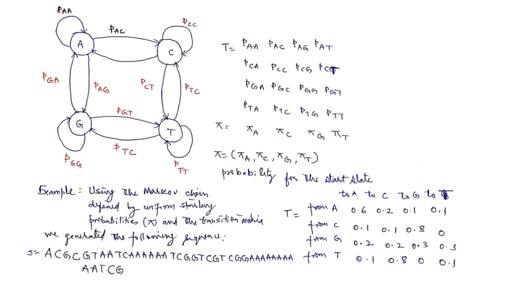
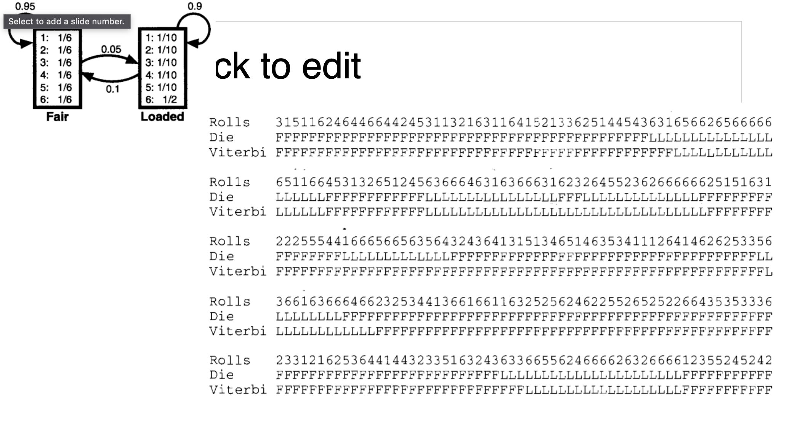

## State Transition Probalbility
- The Condition probability to go to the state t in the next step, given that the current state is s.
- P(Xi+1 = t | Xi = S)
- Xi state at time i.

## Functions
- [seq, states] = hmmgenerate(1000, TRANS, EMIS)
- likelystates = hmmviterbi(seq, TRAN, EMIS)
- PSTATES = hmmdecode(seq, TRAN, EMIS)
- [TRANS_EST, EMIS_EST] = hmmestimate(seq, states)
- hmmtrain(): calculates max likelyhood of estimates of transistion and emmision probabilities from a seq of emissions.

## Questions
- Given a HMM and a seq of states and symbols. What is the probability to get this sequence??
- Given a HMM and a seq of symbols. Can we reconstruct the corresponding sequence of states, assuming that the sequence was generated using the HMM?

## Theory
- States^Symbols = Number of paths
- In order to find most probable path we use Dynamic Programming
- Direct Matlab Function: likelystates = hmmviterbi(seq, TRAN, EMIS)

## Sequence
AB05565